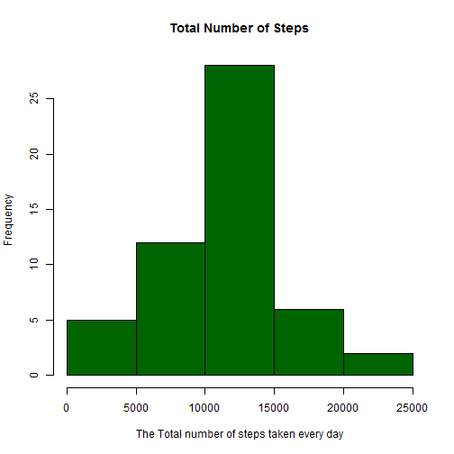
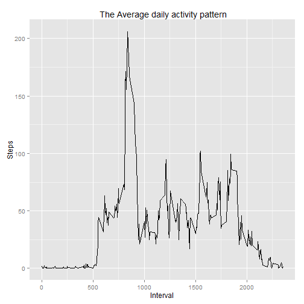
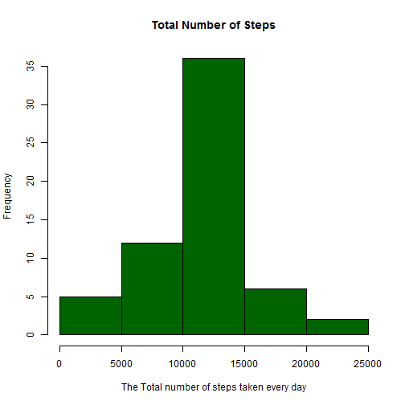
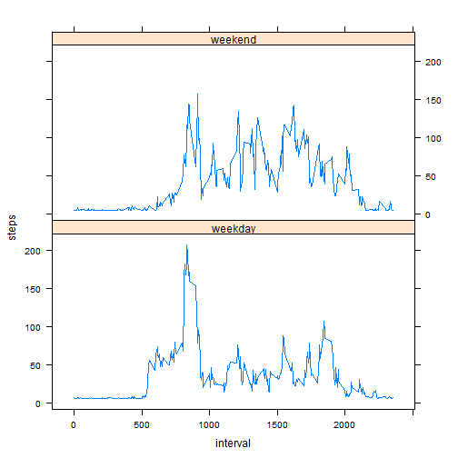

Reproducible Research: Peer Assessment 1

1. Loading and preprocessing the data

Startting points:
- The data have already been downloaded to working directory
- The operating system of computer used is Windows 8.1 and R-commands are defined accordingly 

- Remember when executing the script:
library(knitr)
knit2html("PA1_template.Rmd")

This will generate automatically the figures folder for graphs and .md file


```r
setwd("C://Users//jari//Data_Science//working_Dir//repdata_data_activity")

# Load data
myData <- read.csv("activity.csv", header=TRUE)
summary(myData)
```

```
##      steps                date          interval     
##  Min.   :  0.00   2012-10-01:  288   Min.   :   0.0  
##  1st Qu.:  0.00   2012-10-02:  288   1st Qu.: 588.8  
##  Median :  0.00   2012-10-03:  288   Median :1177.5  
##  Mean   : 37.38   2012-10-04:  288   Mean   :1177.5  
##  3rd Qu.: 12.00   2012-10-05:  288   3rd Qu.:1766.2  
##  Max.   :806.00   2012-10-06:  288   Max.   :2355.0  
##  NA's   :2304     (Other)   :15840
```

2. What is mean total number of steps taken per day?
      For this part of the assignment, you can ignore the missing values in the dataset.

-Calculate the total number of steps taken per day

-Make a histogram of the total number of steps taken each day

-Calculate and report the mean and median of the total number of steps taken per day


```r
library(plyr)

# Total number of steps 
steps_per_day <- ddply(myData, .(date), summarise, steps=sum(steps))

# Histogram
hist(steps_per_day$steps, main="Total Number of Steps", 
     xlab="The Total number of steps taken every day", col="dark green")
```

 

```r
# Mean of Steps
mean_Steps <- mean(tapply(myData$steps,myData$date,sum), na.rm=TRUE)
print(paste0(" Mean for the total number of steps taken every day is: ", mean_Steps))
```

```
## [1] " Mean for the total number of steps taken every day is: 10766.1886792453"
```

```r
# Median of Steps
median_Steps <- median(tapply(myData$steps,myData$date,sum), na.rm=TRUE)
print(paste0(" Median for the total number of steps taken every day is: ", median_Steps))
```

```
## [1] " Median for the total number of steps taken every day is: 10765"
```

3. What is the average daily activity pattern?

- Make a time series plot (i.e. type = "l") of the 5-minute interval (x-axis) and the average number of steps taken,      averaged across all days (y-axis)

- Which 5-minute interval, on average across all the days in the dataset, contains the maximum number of steps?


```r
#3. Create the data containing: mean number of steps for each interval, Variables are "Steps" and "Interval"
average_Steps <- data.frame(tapply(myData$steps, myData$interval, mean, na.rm=TRUE))
names(average_Steps) <- "Steps"
average_Steps$Interval <- as.integer(row.names(average_Steps))

# Printing plot using ggplot2
library(ggplot2)
ggplot(average_Steps) + aes(x=Interval, y=Steps) + geom_line() + labs(title=" The Average daily activity pattern")
```

 

```r
# Result 
print(paste0(" The interval with maximum number of steps is: ", names(which.max(average_Steps$Steps))))    
```

```
## [1] " The interval with maximum number of steps is: 835"
```

4. Imputing missing values

Note that there are a number of days/intervals where there are missing values (coded as NA). The presence of missing days may introduce bias into some calculations or summaries of the data.

- Calculate and report the total number of missing values in the dataset (i.e. the total number of rows with NAs)

- Devise a strategy for filling in all of the missing values in the dataset. The strategy does not need to be sophisticated. For example, you could use the mean/median for that day, or the mean for that 5-minute interval, etc.

- Create a new dataset that is equal to the original dataset but with the missing data filled in.

- Make a histogram of the total number of steps taken each day and Calculate and report the mean and median total number of steps taken per day. 

- Do these values differ from the estimates from the first part of the assignment? 

- What is the impact of imputing missing data on the estimates of the total daily number of steps?


```r
# calculate the number of missing values
missing_values <- sum(is.na(myData$steps))
print(paste0(" The Total amount of missing step values is: ", missing_values))
```

```
## [1] " The Total amount of missing step values is: 2304"
```

```r
# Strategy is: All missing values are filled in with mean step-value of whole data set
print(paste0(" Mean of steps to be used for replacing NA-values is : ", mean(myData$steps,na.rm=TRUE)))
```

```
## [1] " Mean of steps to be used for replacing NA-values is : 37.3825995807128"
```

```r
# create new data-set with NA values
myNewData <- myData

# Replace NA-values with mean of steps
for (i in 1:length(myNewData$steps)) {
    if (is.na(myNewData[i, 1])) {
        myNewData[i, 1] <- mean(myData$steps,na.rm=TRUE)
    } else {
        myNewData[i, 1] <- myNewData[i, 1]
    }
    myNewData
}
# Make a histogram of the total number of steps taken each day
new_steps_per_day <- ddply(myNewData, .(date), summarise, steps=sum(steps))

hist(new_steps_per_day $steps, main="Total Number of Steps", 
     xlab="The Total number of steps taken every day", col="dark green")
```

 

```r
# Calculate and report the mean and median total number of steps taken per day
# Mean of Steps
new_Mean_Steps <- mean(tapply(myNewData$steps,myNewData$date,sum))
print(paste0(" Mean for the total number of steps taken every day is: ", new_Mean_Steps))
```

```
## [1] " Mean for the total number of steps taken every day is: 10766.1886792453"
```

```r
# Median of Steps
new_Median_Steps <- median(tapply(myNewData$steps,myNewData$date,sum))
print(paste0(" Median for the total number of steps taken every day is: ", new_Median_Steps))
```

```
## [1] " Median for the total number of steps taken every day is: 10766.1886792453"
```

```r
# Variation % of the mean due to replaced NA-values
delta_Mean<-(mean_Steps-new_Mean_Steps)/mean_Steps
print(paste0(" Variation % of the mean due to replaced NA-values: ", delta_Mean, " %"))
```

```
## [1] " Variation % of the mean due to replaced NA-values: 0 %"
```

```r
# What is the impact of imputing missing data on the estimates of the total daily number of steps?
delta_Median<-(median_Steps-new_Median_Steps)/median_Steps
print(paste0(" Variation % of the median due to replaced NA-values: ", delta_Median, " %"))
```

```
## [1] " Variation % of the median due to replaced NA-values: -0.000110420738066178 %"
```
Conclusion: 
  Mean values didn't change, because I used the interval average for the given interval
  The median changed slightly. 

5. Are there differences in activity patterns between weekdays and weekends?

- For this part the weekdays() function may be of some help here. 
- Use the dataset with the filled-in missing values for this part.

- Create a new factor variable in the dataset with two levels 
  - "weekday" and "weekend" 

- Make a panel plot containing a time series plot (i.e. type = "l") of the 5-minute interval (x-axis) and the average number of steps taken, averaged across all weekday days or weekend days (y-axis). 

- See the README file in the GitHub repository to see an example of what this plot should look like using simulated data.


```r
# Create new factor variable (Weekday, Weekend) & create the new column based on the day of the week
weekdays <- weekdays(as.Date(myNewData$date))
weekdayData <- transform(myNewData, day=weekdays)
weekdayData$wk <- ifelse(weekdayData$day %in% c("Saturday", "Sunday"),"weekend", "weekday")
Wk_Inteval_Average <- ddply(weekdayData, .(interval, wk), summarise, steps=mean(steps))

# Panel Plot creation
library(lattice)
xyplot(steps ~ interval | wk, data = Wk_Inteval_Average, layout = c(1, 2), type="l")
```

 
